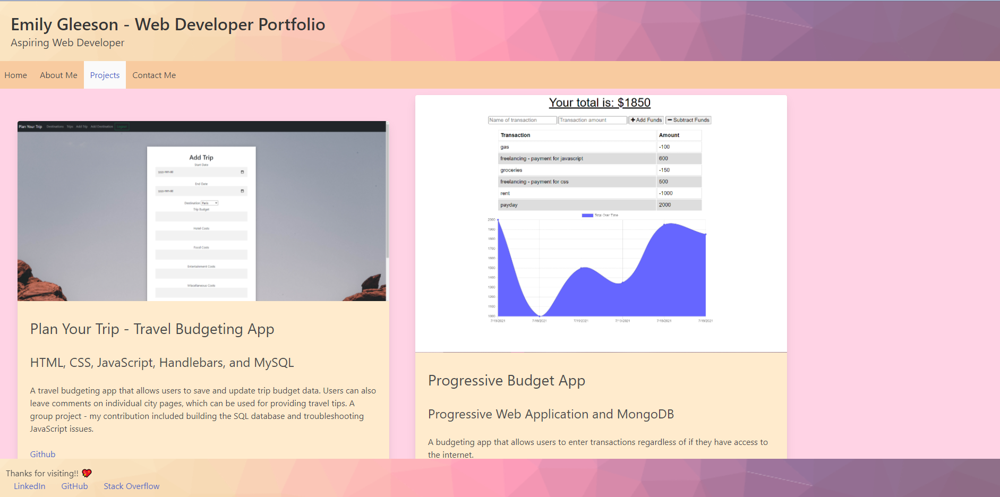

  # React Portfolio

  ## Table of Contents
  - [Description](#description)
  - [Installation Instructions](#installation-instructions)
  - [Usage Information](#usage-information)
  - [Questions?](#questions)

  ## Description
  This is a version of my developer portfolio built using React.
  ## Installation Instructions
  Download the repository from GitHub. Install any required node modules. Run using the command npm run start and begin viewing on the localhost page the app connects to,. Alternatively, access the app at https://gleeson-emily.github.io/react-portfolio/.
  ## Usage Information
  Use by opening ion your browser at https://gleeson-emily.github.io/react-portfolio/ or downloading from GitHub and running per the above instructions.
 
  ## Questions?
  Find me on github at gleeson-emily.